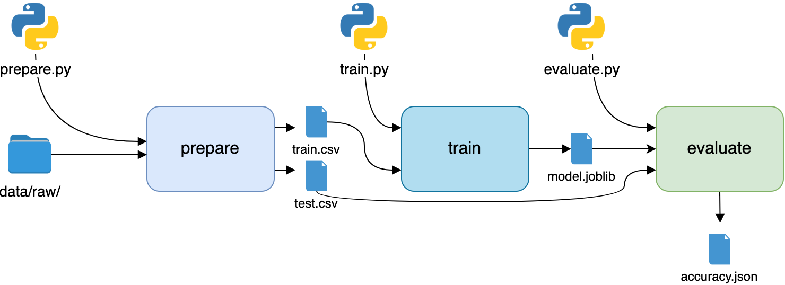
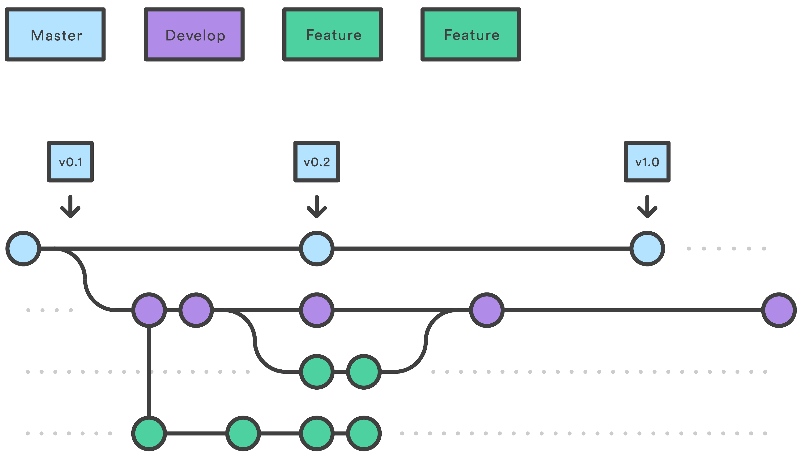
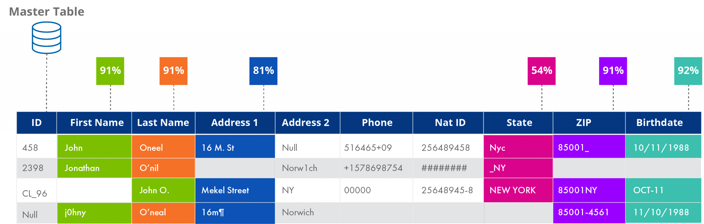
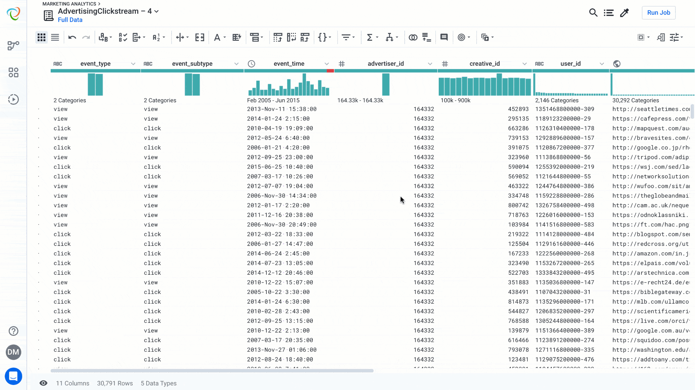
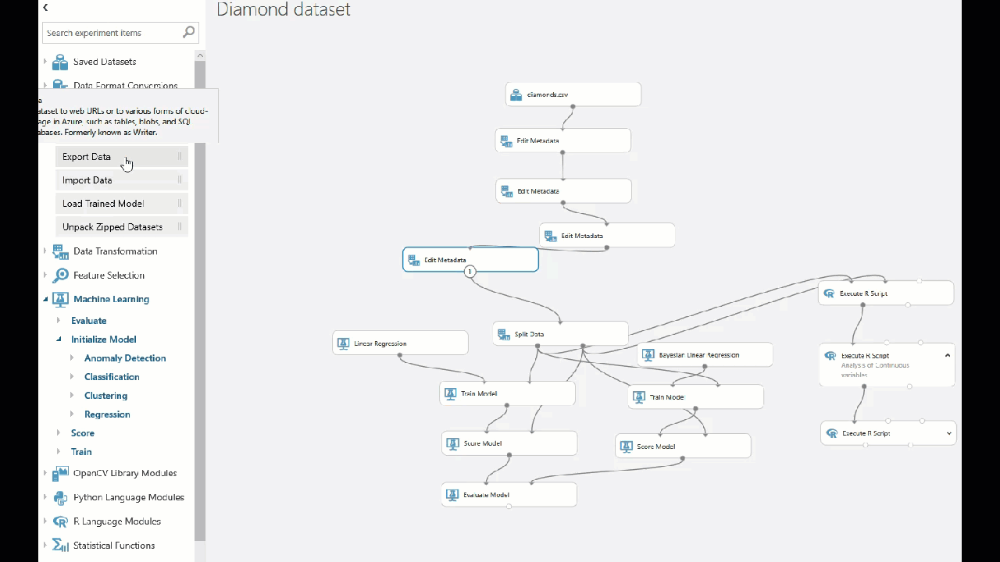

## W1 - Systematic Data Cleaning

### Overview

Before we start, I want to quickly mention that the materials here is not as organized and time-proven as those in the visualization note. Despite being vital to quality and notoriously time-consuming, there seem to be very few courses that teach data cleaning, especially how to systematically clean data. 

The purpose of this notebook is to give a gentle introduction to the task and discuss some improvement directions, all under the context of humanities and social sciences datasets.

As a starter, take a look at [**The Ultimate Guide to Data Cleaning**](https://towardsdatascience.com/the-ultimate-guide-to-data-cleaning-3969843991d4) by Omar Elgabry. 

Out of the many articles, I recommend reading this one because it has:

- a high-level view of data cleaning workflow, 
- broad coverage of cleaning techniques, 
- concise and intuitive examples for all concepts.

Here I will list my main take-aways and organize the discussions around them.

### 1. Overall, we need a systematic and robust `workflow`

> ### The Workflow
> 
> * **Inspection**: Detect unexpected, incorrect, and inconsistent data.
> * **Cleaning**: Fix or remove the anomalies discovered.
> * **Verifying**: After cleaning, the results are inspected to verify correctness.
> * **Reporting**: A report about the changes made and the quality of the currently stored data is recorded.

As the suggested in the article, this seemingly *sequential* process is often *iterative* in reality. But it is still helpful to have this structure in mind in order to create efficient and robust data cleaning process. 

Take my experience cleaning Census data as an example. Thorough **inspection** in the first place could save me a lot of time debugging my string standardization code, which couldn't run because some number and NaN values hid in a column where values are supposed to be of string type.

Another lesson is to always **verify** after cleaning. Sometimes our code doesn't work as expected or even introduce new errors, but we may think the issue is resolved. Even when we verified the spotted issues are resolved, it is a good practice to run inspection again to look for other issues that we haven't thought of.

Finally, it is crucial that when we write data cleaning codes, we **report** what problems are spotted, what changes are required, and how the changes are made. Explicit and implicit assumptions we use in data cleaning could be taken as the features of the original data, which introduce a bias to all downstream analysis tasks if not properly documented.  

In short, **a good data cleaning workflow** would include the following steps: inspect the data carefully before starting to clean, always verify correctness after cleaning, and report the process after verification. 

### 2. We need to know when to `start` and `stop` cleaning

> ### Data Quality
> 
> * **Validity**: The degree to which the data conform to defined business rules or constraints.
> * **Accuracy**: The degree to which the data is close to the true values.
> * **Completeness**: The degree to which all required data is known.
> * **Consistency**: The degree to which the data is consistent, within the same data set or across multiple data sets.
> * **Uniformity**: The degree to which the data is specified using the same unit of measure.

In data cleaning process, when to start and end cleaning are strategic decisions that determine project timeline and human resource demand. The driving factor of these decisions is data quality. Above is a set of widely recognized data quality criteria. Guided by these criteria, we can create corresponding **metrics** that quantify the quality of data and help us decide when to initiate and conclude data cleaning. 

One often neglected aspect is when to **stop** cleaning. As a programmer, it is a good habit to handle corner cases, but sometimes it is simply not worth the time. If a small percentage of data requires manual or hard custom cleaning, it is often more efficient to **flag it and report** that we strategically forgo the cleaning for this small subset. 100,000 may seem too many values to give up cleaning, but it is only **0.1%** of the 1 million data points dataset like Census.

### 3. Understand `why`, fix problems `early`, `retain` as much as possible

##### Understand `why`

> In addition to logging the violations, the causes of these errors should be considered. Why did they happen in the first place?

During the cleaning process, it is often useful to ask ourselves why the data is "dirty". The noise in data may be due to:

* the limitation of **collection method** (as in the case of census taker, ask people from door to door and jott down notes)
* mistakes in **transcription and digitization** (possibly OCR error if the process involves automation)
* **unintentional modifications** introduced by our cleaning methods

Determining the source of the data quality problem helps us decide the most suitable approach to clean the data.

##### Fix problems `early`

Data cleaning is an iterative process where multiple versions of the data may be created. People may also conduct further analysis cleaning on the data product from earlier work of others. Given these scenarios, it seems that we should fix data quality problems as "early" as possible. 

That is, serious data quality problems should ideally be detected and resolved in **earlier versions** of the data. If not, once the released data is used in downstream tasks, the cost of adding new fixes to the upstream data product will be high.

If a new data quality problem is found when working on one of the downstream task, and the group thinks it is an important fix that would benefit all downstream tasks, then the group will undergone the painstaking process of **re-generating** the upstream data product, and **re-running** all downstream analyses with new data as input. 

The updating cost could be lowered if all the data cleaning and analysis are implemented in well-maintained scripts and upstream and downstream tasks are organized into data pipelines. This is one benefit of being systematic.

##### `Retain` as much as possible

While cleaning the data, it is a good practice to keep the original value for future reference. It might be the case that new finding updates our understanding of the data, and previously meaningless distinction become important. 

One such example is with the Occupation description variable in Census dataset. I used to merge "Keeping House", "House Keeper" together into the term "House Keeper". But later I came across a [historical report from 1900](https://www2.census.gov/library/publications/decennial/1900/occupations/occupations-part-5.pdf) on the US Census Bureau website. It says "Keeping House" means a non-paid homemaker's work, while "House Keeper" indicates the person is earning an income. Since these two descriptions are very common (mounting to over 10% of the dataset), the distinction is too important to be ignored. Now we have to consult the reports for each year on the meaning difference, then re-implement the cleaning and re-run on the original data. Here we see the value of always retaining as much information as possible.

### 4. Think and design for the `long term`

There are several aspects to think about when designing for the long term.

1. **Reproducibility**: can future researchers of the current system reproduce the results we are generating now? Will they understand the meaning of variables and current cleaning approaches? Can they adjust the methods and assumptions and re-run data cleaning processes?
2. **Extensibility**: can future developers add new functionalities to the current system easily? Can they introduce the new changes without affecting the normal functions of the system?
3. **Scaling**: will the system work properly when the size/dimension of the data is 10x or 100x larger, when the number of users is 10x or 100x greater? How easy it is to up-scale the system?
4. **Future compatibility**: what are the new trends in underlying technology stack, such as data storage (HDFS/Cloud), visualization medium (VR/AR), etc. How to create the opportunities for future developers and users to transition the system into new technology stack easily? 

## Potential Directions

1. Data processing pipeline / management system
	1. Storage medium and sharing
	2. Data version control
	3. **Data codebook**

	
	
	

2. Script-based data transformation / cleaning
	1. Data profiling
	2. Smart fuzzy matching
	3. Program synthesis

	
	
3. Automatic/Semi-automatic Data Cleaning
4. Visualization and GUI for the above steps
	
	
	
	

 

**Related research papers (updating)**

- Data Cleaning - Overview and Emerging Challenges
- Self-Service Data Preparation - Research to Practice
- Wrangler - Interactive Visual Specification of Data Transformation Scripts
- AlphaClean - Automatic Generation of Data Cleaning Pipelines
- A Demonstration of DBWipes - Clean as You Query

****

Image Credits:

- Fuzzy Matching 101: Cleaning and Linking Messy Data Across the Enterprise |  Data Ladder
- Why Trifacta | Trifacta
- Automatic Version Control for Data Scientists - KDnuggets
- Data Version Control With Python and DVC – Real Python

