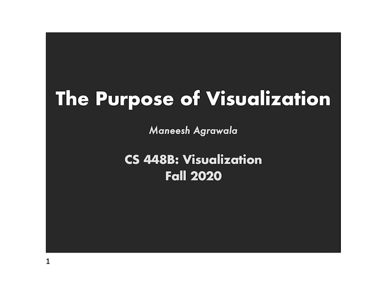
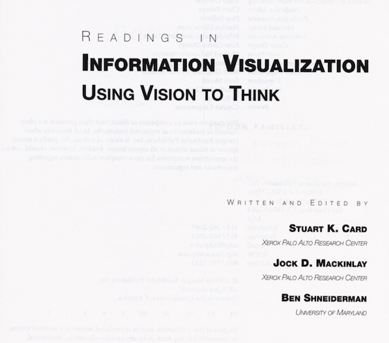
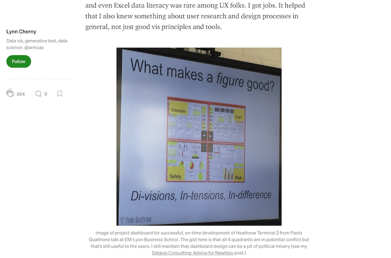

<h2>W1 - What is Visualization and Why Visualize</h2>

<h3>Recommended Reads</h3>

* [**The Purpose of Visualization (Stanford CS 448B Slides)**](https://magrawala.github.io/cs448b-fa20/assets/slides/Lec01-purpose.pdf)
Concise, illustrated slide that covers the definition and rationale of visualization. Recommend to read pdf page 1-25. 

 

* [**Information Visualization, in Readings in Information Visualization by C,M,S - Chapter 1**](https://magrawala.github.io/cs448b-fa20/assets/docs/CardMackinlaySchneid-Chap1.pdf)
Comprehensive, research-oriented book chapter on info viz. Used in many courses, it may give you different angles to think about visualization and how it amplifies our cognition. 

 

* [**Data Visualization “Versus” UI and Data Science**](https://medium.com/@lynn_72328/data-visualization-versus-ui-and-data-science-d59182d58af4)
Practical, hyperlink-rich blog article by industry expert that triangulates three interrelated fields in real-world context: data viz, UI design, and data science. 

 

<h3>Interesting Reads</h3>

This our communal gold mine, please nominate interesting resources that you have found here: 

* 

         

-

<h4>Appendix: Learning Materials By Course</h4> 

UW - DV

* REQUIRED Chapter 1: Information Visualization, in Readings in Information Visualization. Stuart Card, Jock Mackinlay, and Ben Shneiderman. 1999. (CMS - Introduction)
* REQUIRED Introduction to Vega-Lite / Altair. One of: [JavaScript (Observable)](), [Python (Colab)](https://colab.research.google.com/github/uwdata/visualization-curriculum/blob/master/altair_introduction.ipynb), [Python (Python)](https://github.com/uwdata/visualization-curriculum/blob/master/altair_introduction.ipynb).
* OPTIONAL Decision to Launch the Challenger, in Visual Explanations. Edward Tufte. (See also a critique of Tufte's argument.)

GA - IIV

* CMS - Introduction
* [Data Visualization – Best Practices and Foundations](https://www.toptal.com/designers/data-visualization/data-visualization-best-practices)

GA - IV

* [Data Visualization “Versus” UI and Data Science](https://medium.com/@lynn_72328/data-visualization-versus-ui-and-data-science-d59182d58af4)

STAN - VIZ

* [The Purpose of Visualization (CS 448B Slides)](https://magrawala.github.io/cs448b-fa20/assets/slides/Lec01-purpose.pdf)
* REQUIRED [CMS - Introduction](https://magrawala.github.io/cs448b-fa20/assets/docs/CardMackinlaySchneid-Chap1.pdf)
* OPTIONAL [Decision to launch the Challenger, In Visual Explanations. Tufte.](https://magrawala.github.io/cs448b-fa20/assets/docs/challenger.pdf)
* OPTIONAL [Representation and Misrepresentation. (Critique of Tufte's analysis). Boisjoly et al.](https://link.springer.com/article/10.1007/s11948-002-0033-2)
* OPTIONAL [Graphs in Statistical Analysis. F. J. Anscombe. The American Statistician.](https://www.jstor.org/stable/2682899)

SBU - VIZ

* [Introduction (CSE 564 Slides)](https://www3.cs.stonybrook.edu/~mueller/teaching/cse564/CSE%20564%20intro.pdf)

CUL - DV

* [Introduction (SMM 635 Slides)](https://github.com/simoneSantoni/data-viz-smm635/blob/master/week2/slideshow_1.ipynb)

UBC - IV

- Ch 1. What's Vis and Why Do It?
  - [The Nature of External Representations in Problem Solving.](http://dx.doi.org/10.1207/s15516709cog2102_3) Jiajie Zhang. Cognitive Science 21:2 (1997), 179-217.
  - [A Representational Analysis of Numeration Systems.](http://dx.doi.org/10.1016/0010-0277(95)00674-3) Jiajie Zhang and Donald A. Norman. Cognition 57 (1995), 271-295.
  - [Why a Diagram Is (Sometimes) Worth Ten Thousand Words.](http://dx.doi.org/10.1111/j.1551-6708.1987.tb00863.x). Jill H. Larkin and Herbert A. Simon. Cognitive Science 11:1 (1987), 65-99.
  - [Graphs in Statistical Analysis.](http://www.sjsu.edu/faculty/gerstman/StatPrimer/anscombe1973.pdf)F.J. Anscombe. American Statistician 27 (1973), 17-21.
  - [Design Study Methodology: Reflections from the Trenches and the Stacks.](http://www.cs.ubc.ca/labs/imager/tr/2012/dsm/) Michael Sedlmair, Miriah Meyer, and Tamara Munzner. IEEE Trans. Visualization and Computer Graphics (Proc. InfoVis 2012), 18(12):2431-2440, 2012.
  - **Information Visualization: Perception for Design, 3rd edition**, Colin Ware, Morgan Kaufmann, 2013.
  - [Current approaches to change blindness](http://schneider.lrdc.pitt.edu/P2465/Readings/simons_viscog.pdf) Daniel J. Simons. Visual Cognition 7, 1/2/3 (2000), 1-15.
  - **Semiology of Graphics**, Jacques Bertin, Gauthier-Villars 1967, EHESS 1998
  - **The Visual Display of Quantitative Information.** Edward R. Tufte. Graphics Press, 1983.
