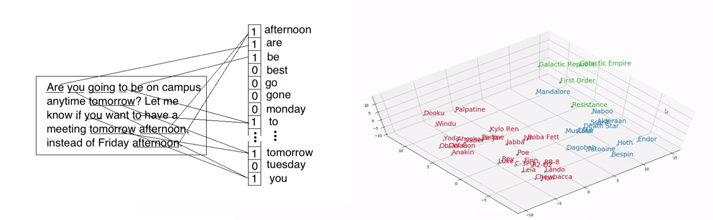

## W3 - Special Data

This note is based on the special data presentation this week. You can find a copy of the deck in the same folder as this note. 

### 1. What are date types and why care?

In the past two weeks, we have discussed visualization theory, data cleaning workflow, as well as exploratory data analysis. One essential element of the different topics is **data type**. We need to know what kind of data type in order to design effective **visual encoding**; when cleaning and managing datasets, data type information is critical to **data modeling**. 

So how many data types are out there? One popular categorization is the measurement typology proposed by Harvard Psychologist Stanley Smith Stevens in the 1960s. 

Here I quote the summary of Stevens' typology by Jeff Hale in [his medium article](https://towardsdatascience.com/7-data-types-a-better-way-to-think-about-data-types-for-machine-learning-939fae99a689) on data types.

> - **Ratio** (equal spaces between values and a meaningful zero value — mean makes sense)
> - **Interval** (equal spaces between values, but no meaningful zero value — mean makes sense)
> - **Ordinal** (first, second, third values, but not equal space between first and second and second and third — median makes sense)
> - **Nominal** (no numerical relationship between the different categories — mean and median are meaningless)

If we look at popular data visualization platforms, here is the data types on [Tableau](https://help.tableau.com/current/pro/desktop/en-us/datafields_typesandroles_datatypes.htm). 

Note: The documentation site of Tableau is quite comprehensive and there are a lot to learn in temrs of platform visual design and visualization workflow.

Here is the interface of the academic exploratory data visualization platform [Voyager 2](https://vega.github.io/voyager2). 

The platform categorized different fields into three categories: `Categorical`, `Temporal`, `Quantitative`. 

One common observation is that the common data types are mostly **numeric** (quantitative or ratio / interval or date time) or **simple text with limited options** (categorical or nominal / ordinal). 

### 2. So why some data types are more popular and what is special data?

The data types we see above are often referred to as "**structured data**". These kinds of data have several good features, see the diagram below from [Lawtomated.com](https://lawtomated.com/structured-data-vs-unstructured-data-what-are-they-and-why-care/). 

The comparison above are mainly about data storage and management. It's worth noting that **special data** (or unstructured data) such as images, raw texts, and geospatial information are also **harder to analyze** (because most statistical and data analysis tools are designed for the structured data types) **and visualize** (although we do have a few specialized charts like word clouds). 

### 3. What special data do we have for the HRL projects?

#### Textual Data

US Census Bureau has several pages that host reports, maps, and documentation of collection methods: [this page](https://www.census.gov/prod/www/index.html) and [this file directory](https://www2.census.gov/library/publications/decennial). (The website claims to have [a newer page](http://census.gov/library/publications.html) serving the publication, but unfortunately the page won't load during my visit.)

The [City Record Project](http://cityrecord.engineering.nyu.edu) at NYU Tandon provides additional reports on the daily operations of NYC from late 19th century to first half of the 20th century. 

Newspapers are a vital source to understand life in the past. Library of Congress has a project "Chronicling America: Historic American Newspapers" which provides [OCR results of hundreds of newspapers](https://chroniclingamerica.loc.gov/ocr/) across many years among other data. Library of Congress Labs also have many [other data resources](https://labs.loc.gov/lc-for-robots) for researchers, as well as [innovative interface](https://news-navigator.labs.loc.gov/?loclr=blogsig) for exploration.

Aside from the data sources, it is worth noting that textual descriptions that have many options can be seen as unstructured textual data. For example, there are about 40K different occupation descriptions in the Census dataset. This amount of potential values is hard for human to mentally keep track of. Thus, such data fields are closer to unstructured data instead of categorical.

 

#### Visual Data

For historical street views, check out this brilliant interactive website called [Old NYC](https://www.oldnyc.org) by Dan Vanderkam. Note that each photo has description on the back of its original copy, thus this data source is visual, textual, and spatial at the same time. I have collected the image dataset through NYPL space-time directory project, contact me if you are interested.

For tax photos, please visit the [NYC Municipal Archives Collections](https://nycma.lunaimaging.com/luna/servlet/NYCMA~5~5). There is also a great website called [1940s.nyc](https://1940s.nyc) by Julian Boilen. 

There are also many other collections, many of these are discovered thanks to our [Data Sourcing Group](https://docs.google.com/document/d/1P6rxtal9qkEUskkyP5WdxzgBX-IYHE1O_MiIVvwi4HI/edit?usp=sharing) at HRL.

- [New York Public Library digital photograph collection](https://digitalcollections.nypl.org/)
- [New-York Historical Society digital photograph collection](https://www.nyhistory.org/library/digital-collections/photographs-of-new-york-city-and-beyond)
- [Museum of the City of New York digital photograph collection](https://www.nyhistory.org/library/digital-collections/photographs-of-new-york-city-and-beyond)
- [Library of Congress digital photograph collection](http://www.loc.gov/pictures/)
- [National Museum of American History Collection](https://americanhistory.si.edu/archives/collections)

 

#### Spatial Data

NYPL hosts many atlases of New York City. Here is a useful [map wrapper](http://maps.nypl.org/warper) page that allows searching and downloading of high-resolution, geo-rectified maps, although it is scheduled to be archived soon. 

Alternative, NYPL Space-Time Directory project also have an [interactive map directory](http://spacetime.nypl.org/maps-by-decade). The project also feature many other [useful datasets and tools](http://spacetime.nypl.org).

In addition, there are many modern NYC GIS data sources that can be overlayed on the historical spatial datasets. NYC Department of City Planning has an [open data page](https://www1.nyc.gov/site/planning/data-maps/open-data.page). The websites [Zola Map](https://zola.planning.nyc.gov/data) and [Facilities Explorer](https://capitalplanning.nyc.gov/map) are two interactive interfaces for those datasets.

 

### 4. How do we transform special data into structured data?

#### Textual Data

Textual data can be transformed into categorical and quantitative data. Take the occupation descriptions in the Census dataset for example: 1) we can cluster/classify the descriptions into industry categories, 2) we can assign quantitative values to each occupation, using additional sources such as IPUMS income scores. 

When turning the textual data into numerical form that can be further analyzed, there are many approaches such as "bag of words" and "word embedding" (see the illustrations below). In the past year, members of the HRL have made progress with the Latent Dirichlet Allocation [LDA topic modelling](https://drive.google.com/drive/folders/1RDG4Vzpicj4FY2jIlKpiQGnaI4wbZIOq?usp=sharing). 

There are also great demand in terms of fuzzy matching for the processing of textual data. Fuzzy matching can fix mispellings and word order variations, or even match words that are semantically similar. This is a very useful feature and much wanted in many data cleaning projects at HRL and other places. Here is a [list of academic papers](https://drive.google.com/drive/folders/1iUOz3_2Pfq2NeWwcpf_aggh0dPwwi3sJ?usp=sharing) I collected about fuzzy match and clustering.

 

#### Visual Data

Visual data are very rich in details and would be valuable new sources of information that help us understand historical life. The outcome can also be applied in building immersive experiences to enable us to walk in the shoes of historical residents of NYC. For example, we can add a texture of reality to VR projects like [this one](https://ethanprintz.com/immersive-experiences/project/nyc-vr-history/) at NYU ITP.

Visual data mining would be a pioneering work at HRL and a great chance to put your computer vision skills at work. For your reference, I have collected [some academic papers](https://drive.google.com/drive/folders/1Xf0Hx3S7chVLQRJU7mz7xwt20mgYd3bn?usp=sharing) on semantic scene parsing of street views, building model reconstruction, real estate price estimation, etc. 

Our data librarian, Yun Dai, has shared a resource for mining visual data. The [Distant Viewing Lab](https://www.distantviewing.org) have tools and resources for visual data mining for the Humanities.

#### Spatial Data

Spatial data is a unique one among special data since longtitude and latitude information are already numerical. But special data needs special handling, and this can't be more true in the case of spatial data. First, geospatial data are often **stored** in many [GIS data layers](https://www.usgs.gov/media/images/gis-data-layers-visualization
). Second, they are indexed with [spatial index bounding boxes](https://blog.couchbase.com/geospatial-basics-spatial-databases-and-nosql-examples/) for better **search** experiences. Third, they are **analyzed** differently compared to traditional data types (which usually have an i.i.d. assumption). For spatial data, geographically weighted regression (GWR) is used instead of OLS regression. Here is an [article](https://towardsdatascience.com/how-are-logistic-regression-ordinary-least-squares-regression-related-1deab32d79f5
), [tutorial](https://methods.sagepub.com/dataset/geographically-weighted-regression-berlin-districts-2018-python), and [a paper](https://www.researchgate.net/publication/275137995_Spatial_heterogeneity_of_the_relationships_between_environmental_characteristics_and_active_commuting_Towards_a_locally_varying_social_ecological_model
) about GWR. Finally, spatial data has many **visualization** opportunities, and not to mention, very visually appealing.

### 5. Transformation among special data

Finally, it is worth mentioning that you can transform or convert one form of special data to another. This always create a wealth of opportunities for creative inquiry. 

At HRL, we had made great effort in the Optical Character Recognition (OCR) of the Board of Health Food Industry Licenses. The work aims to take raw images taken at the archive as input, and produce machine-readable tabular data. The OCR pipeline involves three phases including preprocessing, recognition, and postprocessing. This summer (2021), the preliminary results of the OCR pipeline are being verified by our Data Verification team, so that we can get the data ready for analysis and also create ground-truth values to improve OCR.

There is also a very exciting work happening about map extraction. The goal is to combine OCR, NLP, and geosptial calculation to create geospatial data for city facilities of New York City in the history. For example, where are the schools in 1900s, what are the names and sizes of the schools, is a particular neighborhood lacking the education resources? We can do similar things for house of worships, hospitals and clinics, police and fire stations, etc. Essentially, we can create a historical version of the [facilities explorer](https://capitalplanning.nyc.gov/map) through map extraction. 

---
   

## W3 Exercise

- **Task 1:** Refine and polish your insight report from last week: Add necessary comments and streamline the narrative, such that a person who didn't attend the presentation can understand what you did and how you did it by reading through the notebook. 

> **Note:** Please update the link in the repo if you have made new updates. I will email you individual feedback on your reports for your reference. By ***the middle of next week***, you should have a clean version of the report ready to share with the larger group. 

- **Task 2:** Based on resources about special data above, propose one piece of special data related work that you think 1) will most greatly enrich the data exploration experience, 2) attracts you the most.

	When proposing the idea, please describe: 
	
	1. Which dataset(s) do you plan to use
	2. What kind of transformation you want to apply
	3. How will the outcome be utilized in data exploration (why is it important)
	4. Why you are excited about this work
	5. To what extent do you need to / want to learn new skills to carry out this work

> **Note:** Note that you don't have to stick to this idea for your individual project starting July. You can also propose an idea that might be above your current skill level but sounds very interesting to you. This exercise is meant to encourage you to think more about the rich possibilities with special data, and broaden your pool of choices before you decide on the topic of your mini-project. No formatting requirements for this one, but a basic Google Doc organized by the prompt questions is recommended. Please be prepared to share during the meeting next Tuesday. 
