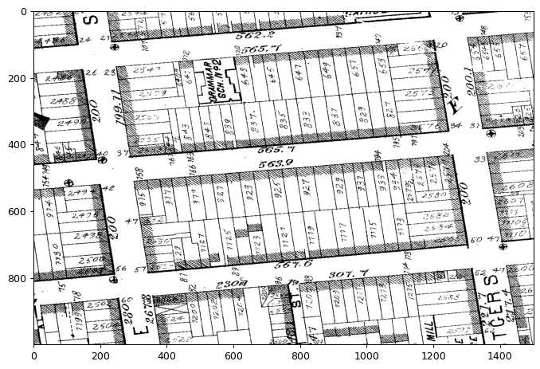
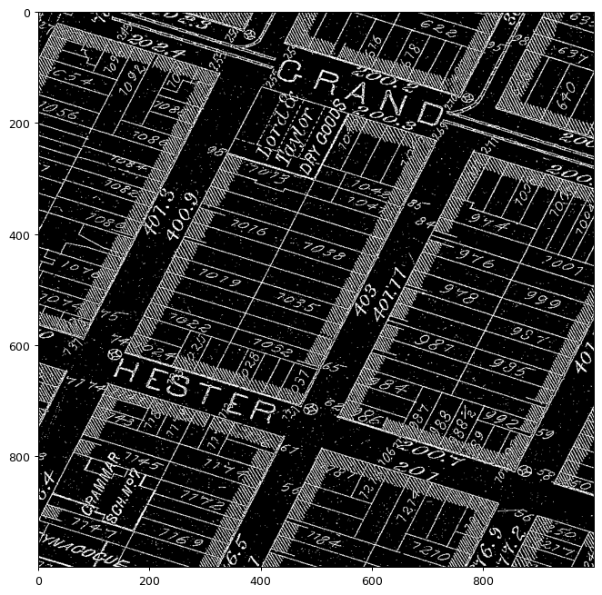
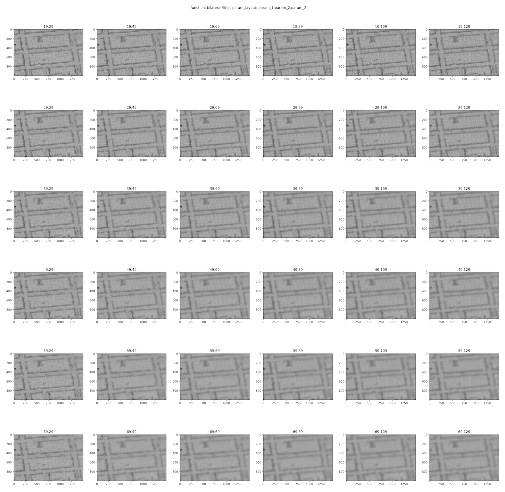

# Map Data Mining
---

## Project 1 - Extracting Historical City Maps

1. Setting Project Goal (20210804) 
	- Extract the shape of contours (georeferenced polygons), build a historical street network (with street names and house number range on each segement); Extract the shapes of individual buldings (footprints) and knowing their corresponding addresses.
2. Data Preparation (20210805) 
	- NYPL's New York City atlases collected for multiple time points, warped GeoTIFF ready in Google Drive folders. This is the outcome of on-going data collection infrastructure build-up since last fall of 2020.

3. Find and Familiarize with GIS Tool (20210805) 
	- For easier integration with computer vision (image processing) tools in the Python ecosystem, I chose to familiarize with GIS tools in Python instead of softwares like QGIS/ArcGIS. Ideally, once this tool is well-tested, it can be packaged into a Plugin to such software. For details, please see appendix below.

4. Experiment Morphology Operation Approach (20210806) 
	- To fix lighting difference, I tried Otsu thresholding (good only for local parts of map, see left) vs AdaptiveThreshold (good for overall but has dot noise, see right).   
	- To extract the shape of city blocks, I tried to "blur" the map than get the large contours (in bromley 1879 layer_id 1403, city blocks have shaded areas on the inner border, thus one idea is to blur and pick up such shaded areas) For blurring, tried medianBlur vs GaussianBlur vs bilateralFiltering vs blur(simple avg). During this process, implemented a parameter grid-search tool for visual comparisons of parameter sets.   The finding is that small amount of blurring doesn't turn shaded areas into concrete borders, while large amount of blurring cause printed street name to merge with block borders. In short, blurring is hard to tune and not clean enough for detecting block contours. Canny + Blur doesn't help much either. Another noticeable problem with the data is that some block has a special building on one border (colored in red) but doesn't have shaded region as other parts do. Also, one trick is inversing the color of the image so that contours are tracing the shape of the blocks (foreground) while streets are in black (background). 
	- Since getting the contours by "looking at it from a bird eye view" (blurrily) is not showing good progress, I tried to make an attempt by creating detailed but rough-edged contours and then pruning them to get smooth city block contours. One common challenge I found with city block contour detection in historical maps is that some street number and dimension number are printed so close to the block border that the numbers touch the border. Then when detecting contours, it is very hard to remove the printed numbers from the contours. For that, I tried detecting comparatively much smaller segments, detecting sudden changes in the directions of line segments, or combination of both. During the process, I realize it's better to first simply the contour with approximate polygons, then remove the comparatively too small segments. The results from this approach is good for some blocks, but not for others. Additional finetuning and human checking is required, which makes the process less attractive.

5. Experiment Marker-based Approach (20210807) 
	- In light of the challenges with detecting the city block contours from raw images, I start to reflect on where the bottlenecks are for this task. Successful batch processing relies on regularity in data. One source of regularity, as analyzed above, comes from the shade region at the inner borders. Another regularity is that the shapes of the city blocks are, in many places, standardized parallelogram. This also means the streets that cut out the blocks are straigt lines most of the time. Once I realized this, I started exploring a manual marking + machine detection approach to expedite the contour detection process.
	- Line vs Dot. The idea is to draw markers in distinct color on top of the raster image, and have machine detecting these markers and build contours based on them. Adding lines are my initial choice, then I experimented with dots at the endpoints of line semgments, which seemed to be a more compact marking system but turned out to be hard to keep track of. Finally, I decided to go with line markers in standard green and spent about one hour to manually mark the map plate #27654 (Plate 5 of Bromley 1879). After some small fine-tuning, the opencv program can detect the green lines and generate clean, indexed contours representing the city blocks, street segments, and crossroads. The task remains is to document which contours represent which blocks and streets.
	- The marker approach was a success with the Plate 5, so I moved to other plates to confirm the generalisability of this method. Soon I realized it is more time-consuming than expected to add line markers to areas where city blocks are not lined up straight (e.g. Plate 2 of Bromley 1879). A fast but less accurate work will result in errors in contour detection while a meticulous pass will require excessive time that offsets the time-saving advantage of this marker approach. 
6. Experiment Modern Street Centerline Approach (20210808) 
	- Reflecting on the approaches so far, I have two takeaways: 1) building the data from scratch is inefficient, even with overlaying markers, 2) original raster data is too messy to work with and workflow may vary from one map to another. To make the extraction process more efficient, we will need to get "hints" from somewhere. Since "hints" from the regularities in raw raster and overlaid markers are hard to extract, I look to other places in time for inspiration. This is based on observations that NYPL maps are georeferenced very carefully that they match modern data street maps quite well. Thus, we can use modern planimetrics or simply street center lines as the markers to guide contours detection in historical maps. 
	- If we choose to go with this approach, then there are two tasks left. The first task is to check and edit the modern street network to fit the historical maps. This is because new streets emerge while old streets disappear or change routes across the years. For checking and editing streets, we can either inspect the map visually and edit shapefile manually in GIS software, or we can train a machine learning model to learn the features of street boundaries in historical maps using modern street locations as guidance, then detect potential places that may have discrepancies. 
	- The second task is to detect the range of house numbers on each street segment. For this later task, I have experimented with Tesseract for Bromley map, but the hand-written street numbers are hard to OCR due to varying shapes. Even for human like myself, I need to check the number range of adjacent street segments in order to confirm certain numbers are indeed what I think they are. This means modeling of the house number sequence is required in addition to OCR. There are two potential ways to solve this challenge. One solution is to use Sanborn maps for extracting house number ranges, because they tend to have cleaner and more consistent fonts for house numbers. Another solution is to again get "hints" from modern street network.
7. Experiment Map Color-based Approach (20210809) 
	- During the process of working with Bromley and also after reading the paper by Mauricio from NYPL "Historical map polygon and feature extractor", I realized that Sanborn maps are more suitable for automatic extraction. This is mainly because 1) visual elements in Sanborn are spaced more spread-out compared to the tight layout of Bromley (e.g. street names or even house numbers rarely touch the boundary of building footprints), 2) the fonts of house numbers in Sanborn map has more consistent style compared to Bromley (although both are hand-written) and every house is numbered not only head and tail of street segment. The original reason for favoring Bromley is that NYPL has nice, integrated Bromley layers at time points around the turn of century. But the quality of Sanborn outweights this benefit of Bromley. I have thus spent some time to identify the Sanborn-style maps and layers and collected them.
	- The roadmap for Map Color-based Approach: auto-finetune-main-color -> color-mask-extraction -> contour-detection-and-simplication -> house-number-ocr.

8. Floodfill Approach (20210810-20210826) 
	- Floodfill approach works well with street detection, which can be inverted to get rough city block contours. Then, footprints can be extracted by doing floodfill from non-building boundaries points within the city block contour. Adaptive thresholding, morphology operations, and an iterative, centrifugal sampling method are used to find seed pixels for the footprint floodfills. After the floodfill, opencv approxPoly are used to smooth the shapes of footprints and convex hulls are found. 
	- The next steps are: 1) make footprint shape more accurate by checking and subtracting the difference between convex hull and approx contour from the convex hull, 2) detecting and ocr'ing house numbers and linking them to the closet footprints, 3) ocr'ing other textual information overlayed on buldings, 4) extract other features such as dots, crosses, skylights, dumb waiters, and elevators. 

## Appendix

**Rasterio**

> High performance, lower cognitive load, cleaner and more transparent code. This is what Rasterio is about. ([Intro](https://rasterio.readthedocs.io/en/latest/intro.html))
> 
> For Mac OS X, pip install rasterio ([Installation for other OS](https://rasterio.readthedocs.io/en/latest/installation.html))
> 
> `import rasterio`
> 
> `dataset = rasterio.open('example.tif')`
> 
> `dataset.count` (number of bands) A dataset band is an array of values representing the partial distribution of a single variable in 2-dimensional (2D) space. All band arrays of a dataset have the same number of rows and columns. 
> 
> `dataset.bounds`
> 
> `dataset.transform` `dataset.transform * (dataset.width, dataset.height) -> (x, y) in the CRS`
> 
> `dataset.crs`
> 
> **Read raster data**
> 
> `dataset.indexes` `(1,)` Following the GDAL convention, bands are indexed from 1.
> 
> `band1 = dataset.read(1)`
> 
> **Translate between pixel positions and coordinates**
> 
> `row,col = dataset.index(x,y)`
> `x, y = dataset.xy(row,col)`
> 
> Create raster data - sample code [here](https://rasterio.readthedocs.io/en/latest/quickstart.html#creating-data).
> 
> Advanced topics
> 
> Raster data processing with CLI [rio-calc](https://rasterio.readthedocs.io/en/latest/topics/calc.html#using-rio-calc) 
> 
> RGB [Color](https://rasterio.readthedocs.io/en/latest/topics/color.html) will be in three separate bands of a GeoTIFF. Check color interpretation by `dataset.colorinterp[0]`, set it during creation using `dataset.profile['photometric']`. 
> 
> [Vector Features](https://rasterio.readthedocs.io/en/latest/topics/features.html) via `shapes()` and `rasterize()`.
> 
> [Interoperability between raster and image](https://rasterio.readthedocs.io/en/latest/topics/image_processing.html)
> 
> `from rasterio.plot import reshape_as_raster, reshape_as_image`
> 
> `raster = rasterio.open("tests/data/RGB.byte.tif").read()`
> `raster.shape (3, 718, 791)`
> 
> `image = reshape_as_image(raster)`
> `image.shape (718, 791, 3)`
> 
> [Masking a raster using a shapefile](https://rasterio.readthedocs.io/en/latest/topics/masking-by-shapefile.html#masking-a-raster-using-a-shapefile). [Nodata Mask](https://rasterio.readthedocs.io/en/latest/topics/masks.html) (Special mask meaning in Numpy vs Rasterio)
> 
> Reduced resolution [overview](https://rasterio.readthedocs.io/en/latest/topics/overviews.html) and [Resampling](https://rasterio.readthedocs.io/en/latest/topics/resampling.html) and [**Plotting**](https://rasterio.readthedocs.io/en/latest/topics/plotting.html). 
> 
> [Reprojection](https://rasterio.readthedocs.io/en/latest/topics/reproject.html)
> 
> High performance: [Concurrent processing](https://rasterio.readthedocs.io/en/latest/topics/concurrency.html), [In-Memory Files](https://rasterio.readthedocs.io/en/latest/topics/memory-files.html), [Windowed reading and writing](https://rasterio.readthedocs.io/en/latest/topics/windowed-rw.html).

**opencv** 

- https://docs.opencv.org/4.5.3/index.html (Colab uses version 4.1.2)
- [Thresholding](https://docs.opencv.org/4.5.2/d7/d4d/tutorial_py_thresholding.html)
- [Contours](https://docs.opencv.org/4.5.2/d3/d05/tutorial_py_table_of_contents_contours.html)

**scikit-image** 

- [scikit-image.org](https://scikit-image.org/)

**Miscellaneous**

A very interesting [StackOverflow Thread](https://stackoverflow.com/questions/56905592/automatic-contrast-and-brightness-adjustment-of-a-color-photo-of-a-sheet-of-pape) about "Automatic Contrast and Brightness Adjustment".

[StackOverflow Thread](https://dsp.stackexchange.com/questions/2411/what-are-the-most-common-algorithms-for-adaptive-thresholding) on Common Adpative Thresholding Algorithms.

[StackOverflow Thread](https://stackoverflow.com/questions/45322630/how-to-detect-lines-in-opencv) on detecting lines and connecting them.

**Additional Resources**: 

- Annotation tool suggested by NYU Librarian [Andrew Battista](https://library.nyu.edu/people/andrew-battista/): [Allmaps](https://observablehq.com/@bertspaan/using-allmaps-to-draw-geojson-on-a-iiif-image).

